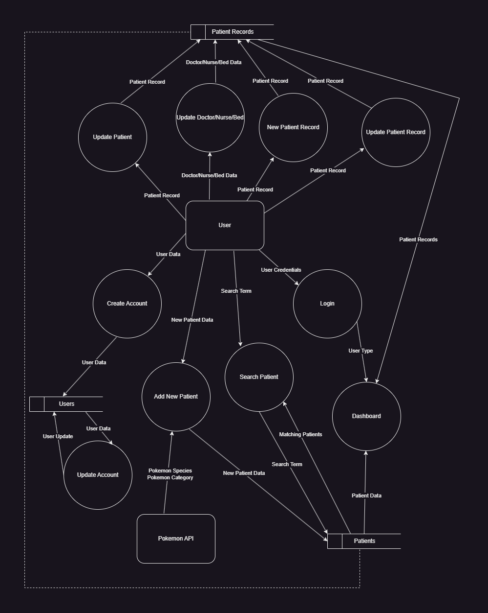
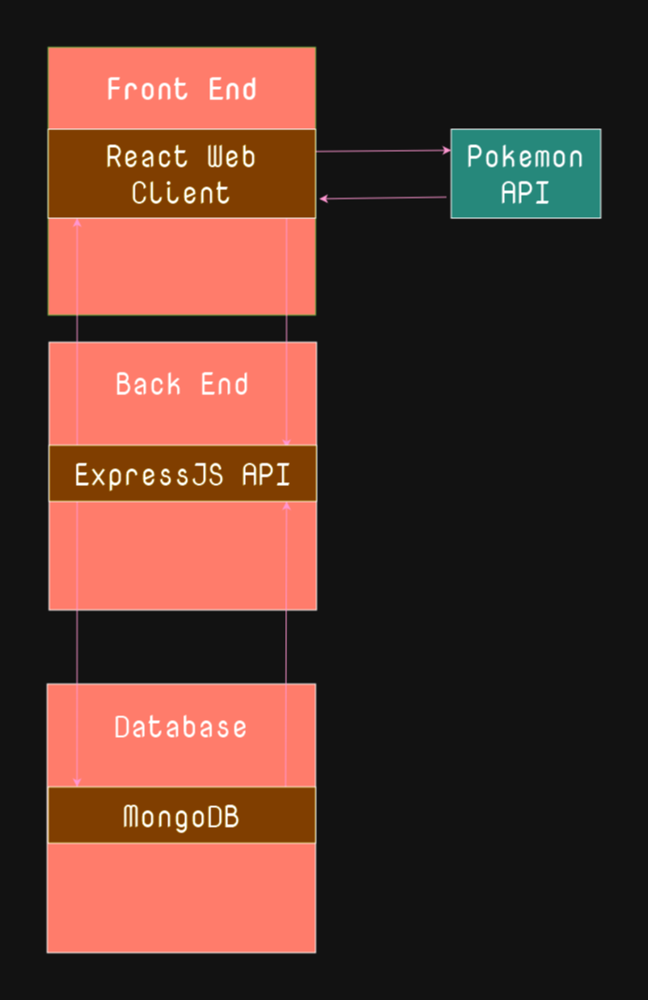
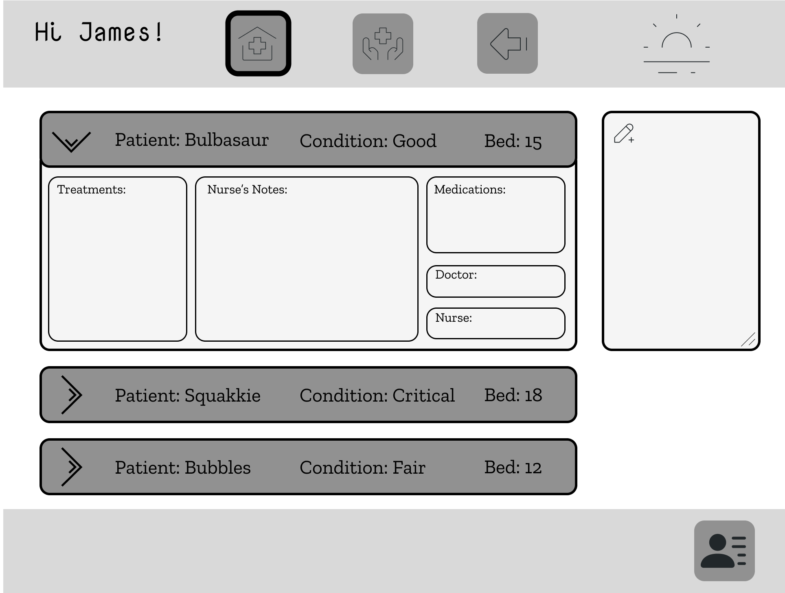

# Figma Board

## [>>Link<<](https://www.figma.com/file/eRReFEEx94JEL5tPjz2szg/Orange-Islands-PMS?type=design&node-id=0%3A1&mode=design&t=85QEwsddastgHguc-1)

# Orange Islands Patient Management System

The Orange Islands is an archipelago home to many unique species of flora and fauna, including Pokémon.
Sunburst Island Health Clinic (Sun Clinic) is a Pokémon Inpatient Facility located on Sunburst Island in the West of the Orange Archipelago.
As you would expect, the majority of clients at this facility are water type Pokémon but the facility treats a variety of Pokémon and a variety of conditions and illnesses. The number of staff varies but currently Sun Clinic employs 20 nurses, 5 doctors with 2 locums and 1 registrar, the facility also has an onsite Pharmacy that services the facility and the community.

The **purpose** of the Orange Islands Patient Management System is to help staff at Sun Clinic manage their patient data therefore the **target audience** is the staff at Sun Clinic.

**Tech Stack**

Front-end: HTML5, CSS3, ReactJS, JavaScript

Back-end: Node, ExpressJS, MongoDB, Mongoose

Deployment: Heroku, Netlify

Testing: Cypress, Jest

DevOps: Git, GitHub, VS Code

# Data Flow Diagram

# Application Architecture Diagram

# Persona, What and Why?

As a Sun Clinic Employee, I want to log into the application with secure credentials to access the patient management system.

As a Nurse at the Clinic, I would like to view a dashboard that provides an overview of the current patients in the clinic, including their status, treatment plans, and assigned healthcare providers.

As a Nurse who is on the frontline of patient interaction, I want to add new patients to the system by entering their basic information, such as name, species, and trainer details.

As a Nurse who deals with patients regularly, I want to update patient records with relevant health information, including treatments, current condition, and prescribed medications.

As a Nurse Manager, I would like to to assign nurses and doctors to specific patients, ensuring proper care and workload distribution.

As a health professional, I want to access a patient's complete health history, including previous condition, medications, and treatments, to make informed decisions about their current care.

As a conscientious team worker at the clinic, I hope I can share information with other healthcare providers through the application, ensuring coordinated care for each patient.

As a tech-savvy individual who cares about getting things done easily, I want to have a user-friendly interface that allows for quick navigation and easy retrieval of patient information, facilitating efficient decision-making and patient care.

As a Sun Clinic Employee, I hope I can log into the application using my unique credentials so that I can access patient records and provide personalized care during my two-week assignment.

As a conscientious user, I would like to be able to update my password regularly so that I can optimise the security of my account.

As someone who is detail oriented, I would like to be able to check and update my account details so that if there are any errors and I need to make adjustments, I can do so easily. 

As a Doctor who isn't always at the clinic, I think a dashboard that displays a list of current patients under my care would be good, it would allow me to stay on top of my workload and slip back into work seamlessly.

As a health professional, I hope I can access comprehensive patient histories to see how the patient's condition has evolved so I can make informed decisions about how to improve their wellbeing.

As a Doctor who wants the best for his patients, I want to easily input and update the patient's condition, treatment plans, and prescription details for each patient to ensure accurate and up-to-date information is available to the clinic staff.

As a conscientious team worker at Sun Clinic, I would like to know that other staff in the clinic have access to patient information when they need it, including pharmacists and nurses, so that patient care is transparent thereby minimising confusion.

As a Employee of Sun Clinic, I want quick access to emergency contact information for each patient in case of unforeseen medical situations, allowing me to keep the patient's trainer in the loop when necessary.

# WireFrames

## Login Page

## Create User

## Dashboard

## Search Page

## Search Results

## Account Details

##  Update Account

## Adding Patient

## Patient Records

## New Patient Entry

# Kanban Board

 

